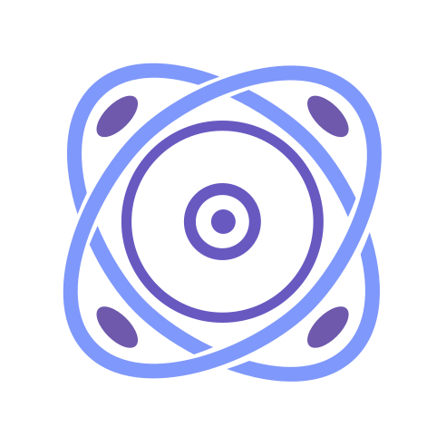

<h1 align="center">
	<a href="https://www.npmjs.com/package/@rbxts/muon">
		
	</a>
	<br />
	<b>Muon</b>
</h1>

<div align="center">

[](https://www.npmjs.com/package/@rbxts/muon)
[](LICENSE.md)

</div>

## 🧬 Muon
Muon is a simple memory store library implementation designed with ease of use in mind

## 📦 Installation
To install Muon, use npm:
```bash
npm install @rbxts/muon
```

## 🤝 Contributing
Contributions are welcome! Please open an issue or submit a pull request on [GitHub](https://github.com/artzified/Muon).

## 📄 License
Muon is licensed under the MIT License. See the [LICENSE](https://github.com/artzified/Muon/blob/master/LICENSE) file for more details.